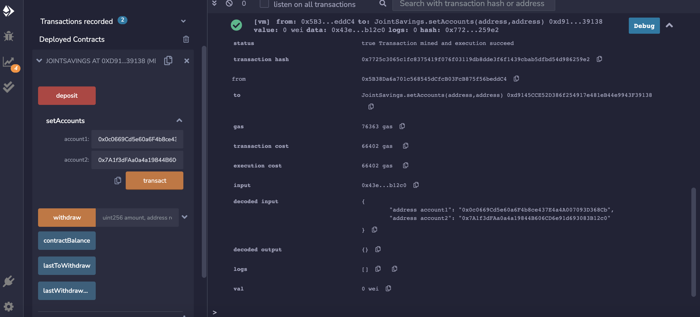

# Solidity
Unit 20 - "Joint Savings Account"
Using Remix to create a smart contract named joint_savings.sol

The following images show its functionality.

---
## Successfully Deployed Smart Contract:

## Using the setAccounts function to define the authorized Ethereum address that will be able to withdraw funds from your contract:

## Testing the deposit functionality of smart contract:
 
  ### Transaction 1: Sending 1 ether as wei:
  
  
  ### Transaction 2: Send 10 ether as wei:
  
  
  ### Transaction 3: Send 5 ether:
  
  
  
## Testing the contract’s withdrawal functionality (lastToWithdraw and lastWithdrawAmount functions):
  
  ### Withdrawing 5 ether into accountOne:
  
  
   *lastToWithdraw and lastWithdrawAmount functions:*
   
   
  
  
  ### Withdrawing 10 ether into accountTwo:
   
   
   *lastToWithdraw and lastWithdrawAmount functions:*
   
   

